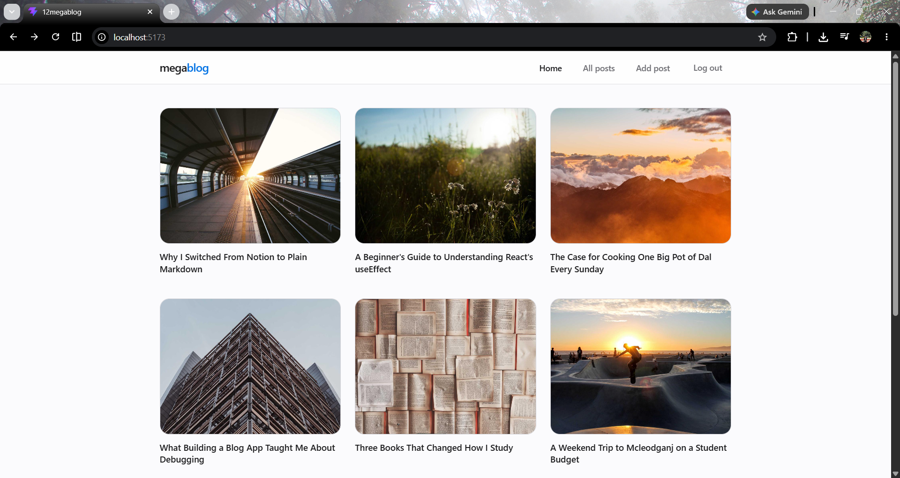
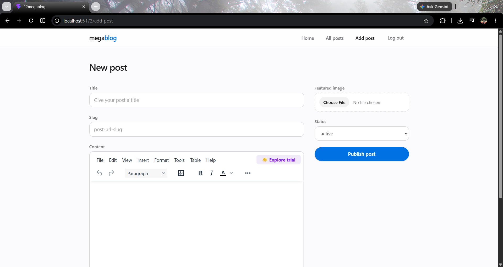
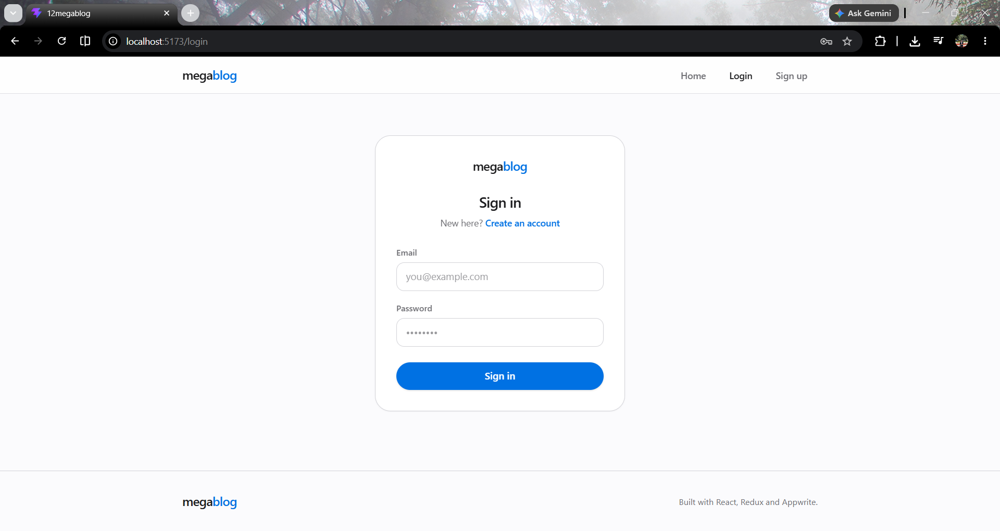

# MegaBlog

A full-stack blogging platform built with React, Redux Toolkit, and Appwrite. Users can create an account, write posts with a rich text editor, upload a featured image for each post, and manage (edit/delete) their own posts — while anyone can browse and read published posts.

<!--
  Add a hero screenshot of the homepage here once you have one:
  
-->

## Features

- **Authentication** — sign up, log in, and log out using Appwrite's email/password auth
- **Rich text editor** — write posts with TinyMCE, including images, formatting, and links
- **Featured images** — upload a cover image per post via Appwrite Storage
- **CRUD for posts** — create, read, update, and delete posts you authored
- **Author-only actions** — edit/delete controls only show up for the post's own author
- **Protected routes** — logged-out users are redirected away from account-only pages
- **Responsive UI** — usable from mobile to desktop, with a sticky nav and mobile menu

## Screenshots

<!--
  Drop your screenshots into a `screenshots/` folder in the repo root, then
  reference them below. A few suggested shots to capture:
    - Homepage (logged out / empty state)
    - Homepage with posts
    - A single post page
    - The "New post" editor
    - Login / Signup screen
-->

| Home | Post editor |
|---|---|
|  |  |

| Post page | Login |
|---|---|
|  |  |

## Tech stack

- **React 19** + **React Router 7** — UI and routing
- **Redux Toolkit** + **React Redux** — auth state management
- **Appwrite** — backend: authentication, database, and file storage
- **TinyMCE** — rich text editing
- **Tailwind CSS 4** — styling
- **React Hook Form** — form state and validation
- **Vite** — build tooling

## Getting started

### 1. Clone and install

```bash
git clone https://github.com/krishna-walia-2006/React-Projects.git
cd React-Projects/12MegaBlog
npm install
```

### 2. Set up Appwrite

You'll need an [Appwrite](https://appwrite.io) project with:

- A **Database** with a **Collection** for posts, containing attributes: `title`, `slug`, `content`, `featuredimage`, `status`, `userid`
- A **Storage bucket** for featured images, with Read/Create permissions configured for your use case
- **Email/Password** enabled under Auth settings
- Your local dev origin (e.g. `localhost:5173`) added under your project's Web platforms

### 3. Configure environment variables

Create a `.env` file in the project root:

```
VITE_APPWRITE_URL = 'your-appwrite-endpoint'
VITE_APPWRITE_PROJECT_ID = 'your-project-id'
VITE_APPWRITE_DATABASE_ID = 'your-database-id'
VITE_APPWRITE_COLLECTION_ID = 'your-collection-id'
VITE_APPWRITE_BUCKET_ID = 'your-bucket-id'
VITE_TINY_API_KEY = 'your-tinymce-api-key'
```

Get a free TinyMCE API key at [tiny.cloud](https://www.tiny.cloud).

### 4. Run it

```bash
npm run dev
```

The app will be running at `http://localhost:5173`.

## Project structure

```
src/
├── appwrite/       # Auth and database/storage service classes
├── components/     # Shared UI components (Header, Footer, PostForm, etc.)
├── conf/           # Environment variable config
├── pages/          # Route-level pages (Home, Post, AddPost, etc.)
├── store/          # Redux store and auth slice
├── App.jsx
└── main.jsx        # Router setup
```

## License

This project is for educational purposes as part of a personal learning journey in React and Appwrite.